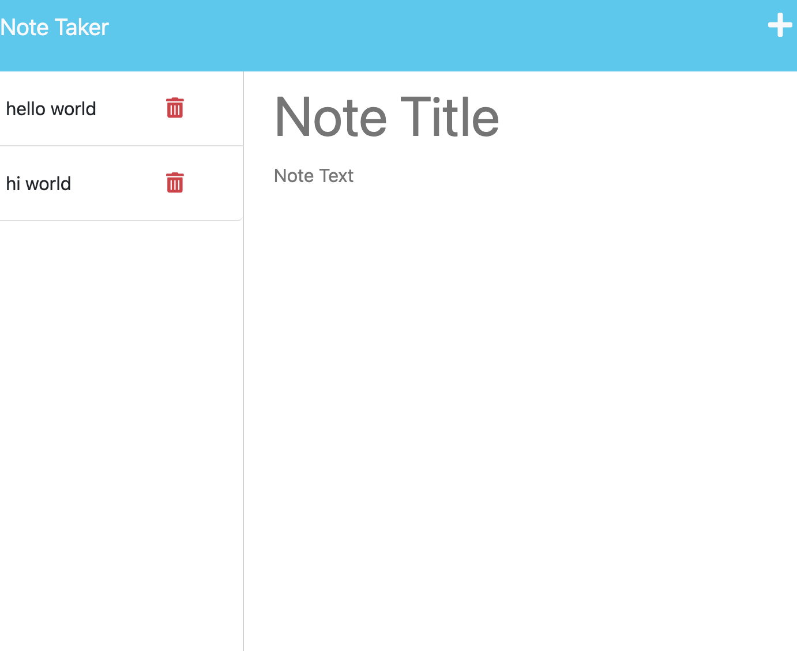

# Express-Note-Taker

## Description

I wanted to create a simple note/task builder application to provide users with an easy way to organize thoughts and keep track of tasks. I wanted to implment the knowledge I have learned on Express Js and connect front and backend programs.This application will help all users stay on top of their priorites by allowing them to input task with a title and description of what it is the need to do. There is also a delete functinality so whenever the user is done with the task, or no longer needs the note they can then remove it so it is no longer in the storage container.

## Table of Contents (Optional)

If your README is long, add a table of contents to make it easy for users to find what they need.

- [Installation](#installation)
- [Usage](#usage)
- [Credits](#credits)
- [License](#license)

## Installation

To run this application there are no installations for the user. However, on the backend side you have to run npm init, nmp install express, npm uuid, and npm fs install: all which I will link in credits if you would like to try yourself.

## Usage

To use this application you will first be taken to the homepage where you will click on the blue "get started" button. Then the user will be prompted to the "notes" page where you will type in the "note title" section, the title of your notes amd in the section below, your actual notes. After, as save button will appear on the screen that you can click and the note will be stored on the left hand side of the screen. If you no longer want to see the note you wrote, you can press the delete button and the note will do so. When you are all done you can click the "note taker" at the left top corn of the page to take you back to the home page.

## Credits

https://expressjs.com/en/starter/installing.html
https://learning.postman.com/docs/writing-scripts/script-references/test-examples/
https://nodejs.org/api/fs.html
https://www.npmjs.com/package/uuid
https://www.npmjs.com/package/util
https://nodejs.org/dist/latest-v8.x/docs/api/util.html#util_util_promisify_original
https://www.geeksforgeeks.org/express-js-app-delete-function/
https://stackoverflow.com/questions/70815888/update-frontend-after-using-delete-route-in-express-js

## License

Refer to documentation listed in repo: https://mit-license.org/

## How to Contribute

 The [Contributor Covenant](https://www.contributor-covenant.org/) 
